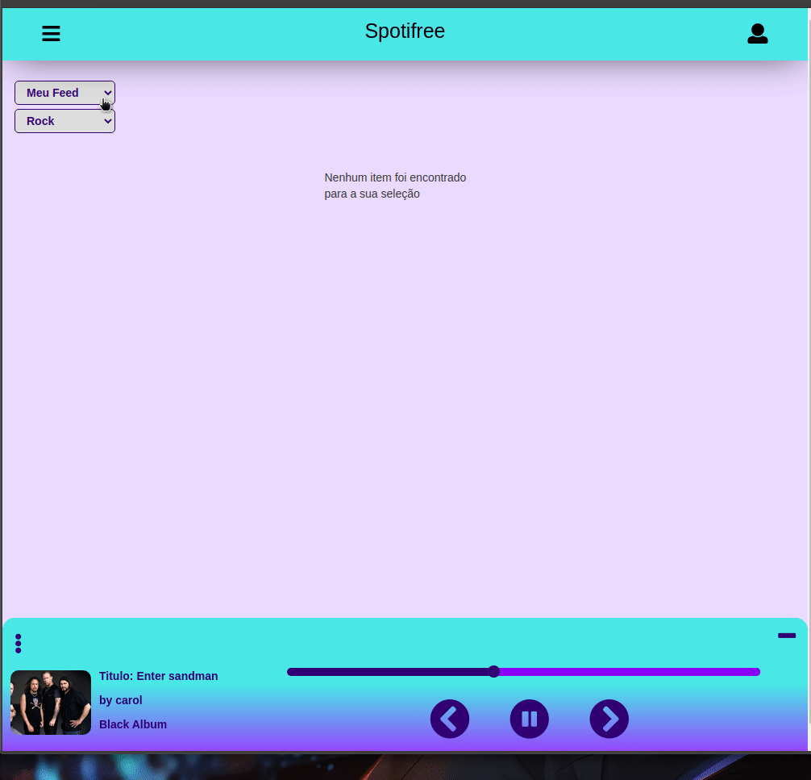
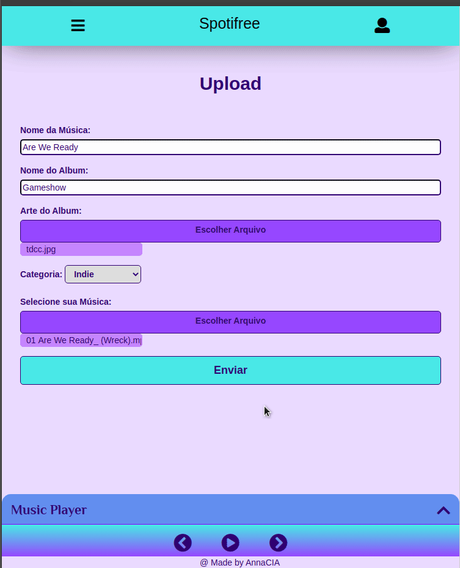

# Spotifree :musical_note:
O Spotifree foi meu primeiro projeto em PHP (tenho um grande amor por ele kkkk). Ele é inspirado no Spotify e 4Shared, foi feito em uma disciplina de PHP que tive na faculdade do IFSP.

****
## :books: Sumário
1. [Funcionalidades](#funcionalidades)
2. [Tecnologias utilizadas](#tecnologias)
3. [Demonstração](#demonstracao)
4. [Instruções](#instrucoes)

****
<div id='funcionalidades'/>

## :electric_plug: Funcionalidades

- Cadastrar usuário;
- Fazer o upload de uma música;
- Criar Playlists;
- Ouvir músicas. 

****
<div id='tecnologias'/>

## :wrench: Tecnologias utilizadas

- PHP;
- MySQL
- JQuery;
- Sass;
- Bootstrap.

****
<div id='demonstracao'/>

## :tv: Demonstração

Tenha acesso a todas as músicas do sistema
<p align="center">
    
</p>

Escute as músicas no próprio player do sistema
<p align="center">
    
</p>


****
<div id='instrucoes'/>

## :computer: Instruções

* Após clonar esse projeto, o arquivo ```dump.sql``` deve ser importado para o banco spotifree no MySQL;
* O arquivo ```autoload/classes/Model/Conexao.php``` deve ser alterado com as configurações do seu MySQL;
* O pré processador Sass deve ser instalado para a manipulação do css no projeto, as instruções de instalação se encontram nesse link: ```https://sass-lang.com/install```
